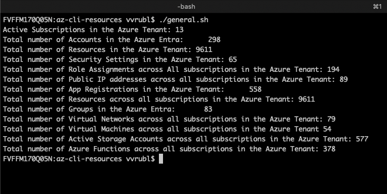

# Numbers of entities in the azure for the Penetration testing
 
### For the recuring Penetration testing run by Mandian quarterly we have to collect and provide some numbers:

* Elevate your PIM to Global Admin role
* Run `az login`
* Run script from the repository: `./general.sh`
* Fille the form provided by Mandiant with the numbers.

| Resource Type      | Script or Command | Resource Count |
|--------------------|-------------------|----------------|
| Azure Subscription |      |       |
| Accounts           |  |        |
| Resources          |     |       |
| Security Settings  |  |        |
| Role Assignments   |     |          |
| Public IPs         |  |        |
| App Permissions    |      |        |
| Services           |    |       |
| Users              |      |        |
| Groups             |    |       |
| App Lists          |      |        |
| Virtual Networks   |    |       |
| Storage Blobs      |    |       |
| Network Application (ASG) / Network Security (NSG) Groups |      |        |
| Policies           |    |       |
| Azure Functions    |      |        |
| M/O365 Tenants     |    |       |
| M/O365 License     |    |       |
| Azure AD License   |      |        |
| Licensed Users     |    |       |